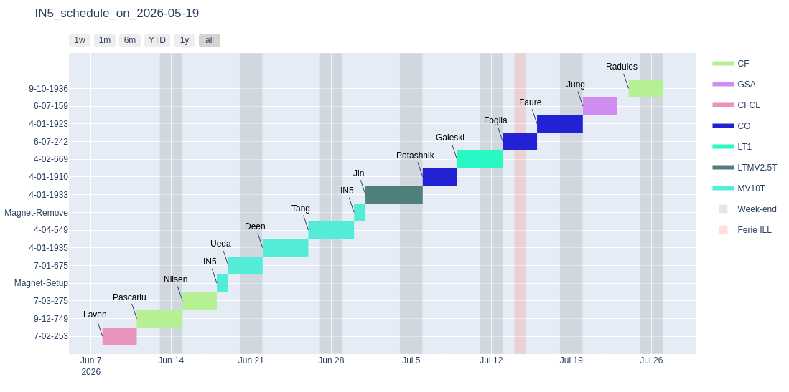

### Schedule as Gantt chart

Tue May 19 12:19:02 PM CEST 2026

Create an interactive Gantt chart for the IN5 schedule. Data are coming  from the `plan` software. The chart is produced as a `html` file with interactive widgets from `plotly` (not visible in the plot below).

#### Dependencies

`plan` (https://www.bitrot.de/plan.html)

`plotly`

